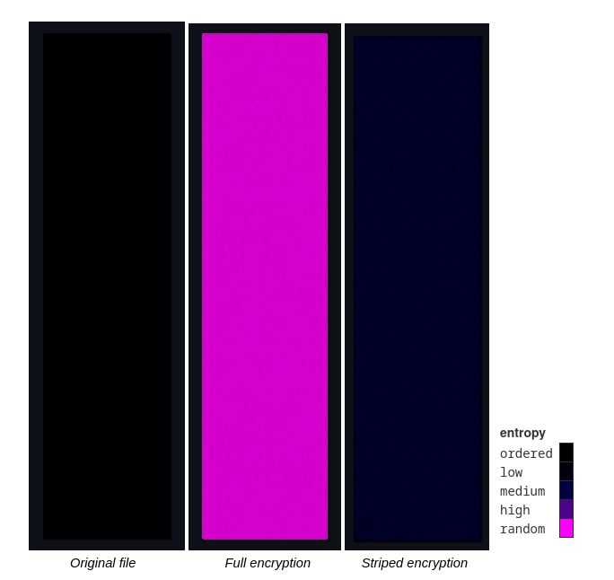
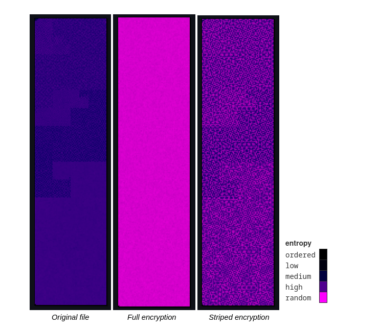

# ITO5163 

## 'Striped' ChaCha20 to evade write-entropy based inspection

This repository contains a rust based proof (PoC) of concept for implementing 'striped' ChaCha20 encryption of files to evade ransomware prevention solutions based on inspecting the entropy of data passed to disk-write system calls. An example of a write-entropy-based solution was suggested by Elkhail et al in "Seamlessly Safeguarding Data Against Ransomware Attacks" published IEEE Transactions on Dependable and Secure Computing volume 20, issue 1, January 2023. 

This PoC is intended to demonstrate that threat actors can evade write-entropy-based inspection and increase the performance of encryption routines by encrypting 'stripes' through target files, followed by a segment of untouched data. The encryption approach implemented here is not novel, and has been implemented in contemporary ransomware including Black Basta's ransomware variant.  



Visualisation of comparative entropy against 5 MiB of null bytes using a 64 byte stripe and a 192 byte skip.



Visualisation of comparative entropy against a 1.2 MiB SQL file using a 64 byte stripe and a 192 byte skip.

### Build

To build the release binary for your operating system and architecture, change to the project root directory and run (requires rust & cargo installation):

```cargo build --release```

### Usage

The binary accepts the following arguments:
- `--path` - the path to the target file
- `--stripe` - number of bytes to encrypt per stripe
- `--skip` - number of bytes to skip between stripes
- optionally, `-d` or `--data` - return results as JSON strings to aid data analysis
- optionally, `-w` or `--write` - write the encrypted files to disk

Note that the PoC should never overwrite the target file.

Also included is a Python script to recursively pipe inputs to the binary to gather large amounts of data. The Python script, `test_coordinator.py` accepts the following arguments:
- `--path` or `-p` - the directory to start recursing from
- `--output` or `-o` - output file (ndJSON)
- `--stripe` or `-s` - number of bytes to encrypt per stripe
- `--skip` or `-k` - number of bytes to skip between stripes

### Example outputs

normal mode:

``` 
File name: BikeStores Sample Database - load data.sql
Encryption stripe value: 64
Skip stripe value: 192
File byte length: 1304827
Initial file entropy: 5.2604103
File read elapsed time: 0.01
Full encryption file entropy: 7.999848
Full encryption elapsed time: 0.00
Full encryption entropy delta: 2.7394376
Striped encryption file entropy: 6.4656854
Striped encryption elapsed time: 0.00
Striped encryption entropy delta: 1.205275
```

`--data` mode:

```
{"filename":"BikeStores Sample Database - load data.sql","stripeValue":64,"skipValue":192,"initialEntropy":5.2604103,"readTime":0.013000803,"fullEncryptionEntropy":7.999848,"fullEncryptionTime":0.001004607,"fullEncryptionEntropyDelta":2.7394376,"stripedEncryptionEntropy":6.4656854,"stripedEncryptionTime":0.001010683,"stripedEncrptionEntropyDelta":1.205275}
```